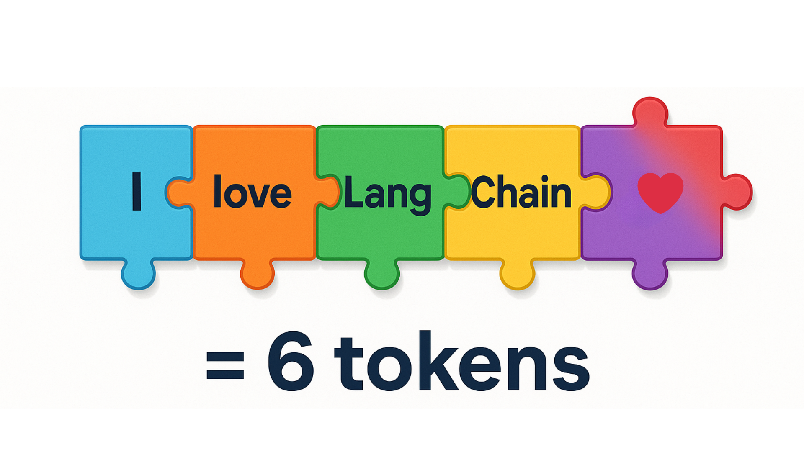
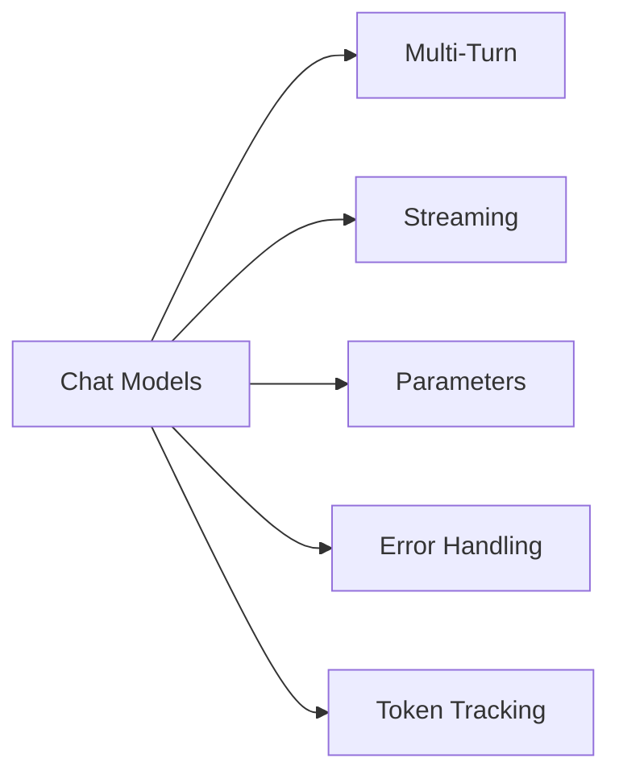

# Chat Models & Basic Interactions

In this chapter, you'll learn the art of having natural conversations with AI models. You'll learn how to maintain conversation context across multiple exchanges, stream responses in real-time for better user experience, and handle errors gracefully with retry logic. You'll also explore key parameters like temperature to control AI creativity and understand token usage for cost optimization.

## Prerequisites

- Completed [Introduction to LangChain](../01-introduction/README.md)

## Learning Objectives

By the end of this chapter, you'll be able to:

- ✅ Have multi-turn conversations with AI
- ✅ Stream responses for better user experience
- ✅ Handle errors gracefully
- ✅ Control model behavior with parameters
- ✅ Understand token usage

---

## 📖 The Knowledgeable Friend Analogy

**Imagine you're having coffee with a knowledgeable friend.**

When you talk to them:

- 💬 **You have a back-and-forth conversation** (not just one question)
- 🧠 **They remember what you said earlier** (conversation context)
- 🗣️ **They speak as they think** (streaming responses)
- 😊 **They adjust their tone** based on your preferences (model parameters)
- ⚠️ **Sometimes they need clarification** (error handling)

**Chat models work the same way!**

Unlike simple one-off questions, chat models excel at:

- Multi-turn conversations
- Maintaining context
- Streaming responses in real-time
- Adapting their behavior

This chapter teaches you how to have natural, interactive conversations with AI.


*Chat models work like a knowledgeable friend - having back-and-forth conversations with context and adaptability*

---

## 💬 Multi-Turn Conversations

Previously, we sent single messages. But real conversations have multiple exchanges.

### How Conversation History Works

Chat models don't actually "remember" previous messages. Instead, you send the entire conversation history with each new message.

**Think of it like this**: Every time you send a message, you're showing the AI the entire conversation thread so far.


*How the messages list builds up over multiple exchanges - full history sent with each invoke()*

---

### Message Types in LangChain

LangChain provides three core message types for building conversations:

| Type | Purpose | Example |
|------|---------|---------|
| **SystemMessage** | Set AI behavior and personality | `SystemMessage(content="You are a helpful coding tutor")` |
| **HumanMessage** | User input and questions | `HumanMessage(content="What is Python?")` |
| **AIMessage** | AI responses with metadata | Returned by `model.invoke()` with `content`, `usage_metadata`, `id` |

> **💡 Looking ahead:** In [Prompts, Messages, and Structured Outputs](../03-prompts-messages-outputs/README.md), you'll learn when to use messages vs templates and additional construction patterns for building agents.

---

### Creating Messages

In this course, we use **message classes** to create messages. This approach is explicit and beginner-friendly:

```python
from langchain_core.messages import SystemMessage, HumanMessage, AIMessage

messages = [
    SystemMessage(content="You are a helpful assistant"),
    HumanMessage(content="Hello!")
]
```

**Why message classes?**

- ✅ **Clear and explicit** - Easy to understand what each message represents
- ✅ **Type hints** - Python type checkers help catch errors
- ✅ **Better autocomplete** - Your editor helps you write code faster
- ✅ **Consistent pattern** - Same approach used throughout the course

> **💡 Other ways exist:** LangChain also supports dictionary format (`{"role": "system", "content": "..."}`) and string shortcuts for simple cases. You'll learn about these alternative syntaxes and when to use each approach in [Prompts, Messages, and Structured Outputs](../03-prompts-messages-outputs/README.md).

---

**Why message history?**

**Imagine you're building a coding tutor chatbot.** When a student asks "What is Python?", then follows up with "Can you show me an example?", the LLM needs to remember they're talking about Python. Without conversation history, it wouldn't know what "it" or "an example" refers to.

**That's where maintaining message history comes in.** By storing all previous messages (system, human, and AI) in a list and sending the full history with each request, the AI can reference earlier parts of the conversation and provide contextually relevant responses.

### Example 1: Multi-Turn Conversation

Let's see how to maintain conversation context using a `messages` list with `SystemMessage`, `HumanMessage`, and `AIMessage`.

**Key code you'll work with:**

```python
# Build the conversation list
messages = [
    SystemMessage(content="You are a helpful coding tutor..."),
    HumanMessage(content="What is Python?"),
]

# Get AI response and add it to history
response1 = model.invoke(messages)
messages.append(AIMessage(content=response1.content))

# Continue the conversation - AI remembers context
messages.append(HumanMessage(content="Can you show me a simple example?"))
response2 = model.invoke(messages)
```

**Code**: [`code/01_multi_turn.py`](./code/01_multi_turn.py)  
**Run**: `python 02-chat-models/code/01_multi_turn.py`

**Example code:**

```python
from langchain_openai import ChatOpenAI
from langchain_core.messages import HumanMessage, AIMessage, SystemMessage
from dotenv import load_dotenv
import os

load_dotenv()

def main():
    print("💬 Multi-Turn Conversation Example\n")

    model = ChatOpenAI(
        model=os.getenv("AI_MODEL"),
        base_url=os.getenv("AI_ENDPOINT"),
        api_key=os.getenv("AI_API_KEY"),
    )

    # Start with system message and first question
    messages = [
        SystemMessage(content="You are a helpful coding tutor who gives clear, concise explanations."),
        HumanMessage(content="What is Python?"),
    ]

    print("👤 User: What is Python?")

    # First exchange
    response1 = model.invoke(messages)
    print("\n🤖 AI:", response1.content)
    messages.append(AIMessage(content=response1.content))

    # Second exchange - AI remembers the context
    print("\n👤 User: Can you show me a simple example?")
    messages.append(HumanMessage(content="Can you show me a simple example?"))

    response2 = model.invoke(messages)
    messages.append(AIMessage(content=response2.content))
    print("\n🤖 AI:", response2.content)

    # Third exchange - AI still remembers everything
    print("\n👤 User: What are the benefits compared to other languages?")
    messages.append(HumanMessage(content="What are the benefits compared to other languages?"))

    # the 3rd AI response is not added to conversation history since it is the last in the conversation
    response3 = model.invoke(messages)
    print("\n🤖 AI:", response3.content)

    print("\n\n✅ Notice how the AI maintains context throughout the conversation!")
    print(f"📊 Total messages in history: {len(messages)} messages, that include 1 system message, 3 Human messages and 2 AI responses")

if __name__ == "__main__":
    main()
```

> **🤖 Try with [GitHub Copilot](https://github.com/features/copilot) Chat:** Want to explore this code further? Open this file in your editor and ask Copilot:
>
> - "Why do we need to append AIMessage to the messages list after each response?"
> - "How would I implement a loop to keep the conversation going with user input?"

### Expected Output

When you run this example with `python 02-chat-models/code/01_multi_turn.py`, you'll see a three-exchange conversation:

```bash
💬 Multi-Turn Conversation Example

👤 User: What is Python?

🤖 AI: [Detailed explanation of Python]

👤 User: Can you show me a simple example?

🤖 AI: [Python code example with explanation]

👤 User: What are the benefits compared to other languages?

🤖 AI: [Explanation of Python benefits]

✅ Notice how the AI maintains context throughout the conversation!
📊 Total messages in history: 6 messages, that include 1 system message, 3 Human messages and 2 AI responses
```

Notice how each response references the previous context - the AI "remembers" because we send the full message history with each call!

### How It Works

**Key Points**:

1. **Messages list holds the entire conversation** - We create a Python list that stores all messages (system, human, and AI)
2. **Each response is added to the history** - After getting a response, we append it to the messages list
3. **The AI can reference earlier messages** - When we ask "Can you show me a simple example?", the AI knows we're talking about Python from the first exchange
4. **Full history is sent each time** - With every `invoke()` call, we send the complete conversation history

**Why this matters**: The AI doesn't actually "remember" anything. It only knows what's in the messages list you send. This is why maintaining conversation history is crucial for multi-turn conversations.

---

## ⚡ Streaming Responses

When you ask a complex question, waiting for the entire response can feel slow. Streaming sends the response word-by-word as it's generated.

**Like watching a friend think out loud** instead of waiting for them to finish their entire thought.

**You're building a chatbot where users ask complex questions.** With regular responses, users stare at a blank screen for 5-10 seconds wondering if anything is happening. With streaming, they see words appearing immediately—just like ChatGPT—which feels much more responsive even if the total time is the same.


*Non-streaming shows the full response at once after waiting, while streaming displays words progressively for better UX*

### Example 2: Streaming

Let's see how to use `.stream()` instead of `.invoke()` to display responses as they're generated.

**Key code you'll work with:**

When streaming a response we use this format in python

```python
# Stream the response instead of waiting for it all at once
for chunk in model.stream("Explain how the internet works in 3 paragraphs."):
    print(chunk.content, end="", flush=True)  # Display immediately without newline
```

**Code**: [`code/02_streaming.py`](./code/02_streaming.py)
**Run**: `python 02-chat-models/code/02_streaming.py`

**Example code snippet:**

> [!NOTE]
> The actual file [`02_streaming.py`](./code/02_streaming.py) includes additional timing measurements and a comparison between streaming and non-streaming approaches to demonstrate the performance benefits. The code below shows the core streaming concept for clarity.

```python
from langchain_openai import ChatOpenAI
from dotenv import load_dotenv
import os

load_dotenv()

#function is called streaming_example in 02_streaming.py 
def main():

    print("🤖 AI (streaming):")

    model = ChatOpenAI(
        model=os.getenv("AI_MODEL"),
        base_url=os.getenv("AI_ENDPOINT"),
        api_key=os.getenv("AI_API_KEY")
    )

    # Stream the response chunk by chunk
    for chunk in model.stream("Explain how the internet works in 2 paragraphs."):
        # Write each chunk as it arrives (no newline)
        print(chunk.content, end="", flush=True) 

    print("\n\n✅ Stream complete!")

if __name__ == "__main__":
    main()
  
```

### Expected Output

If you were to run just the `streaming_example` function in `python 02-chat-models/code/02_streaming.py`, you'll see the response appear word-by-word and look something like this:

```bash
🤖 AI (streaming):
The internet is a global network of interconnected computers that communicate using standardized protocols, primarily TCP/IP. When you visit a website, your device sends a request to a server, which responds with the data needed to display the page. This data travels through multiple routers and networks before reaching you.

At its core, the internet works through a system of addresses called IP addresses, which uniquely identify each device. Domain names (like bing.com) are translated to IP addresses by DNS servers. When you type a URL, your browser contacts these DNS servers to find the right destination. Data on the internet is broken into small packets that travel independently and are reassembled at the destination. This packet-switching method makes the internet resilient and efficient, allowing information to take different routes if one path is blocked or congested.

✅ Stream complete!
```

You'll notice the text appears progressively, word by word, rather than all at once!

### How It Works

**What's happening**:

1. We call `model.stream()` instead of `model.invoke()`
2. This returns a generator that yields chunks as they're generated
3. We loop through each chunk with a for loop
4. Each chunk contains a piece of the response (usually a few words)
5. We use `flush=True` to display text immediately, creating the streaming effect

**Benefits of Streaming**:

- Better user experience (immediate feedback)
- Feels more responsive - users see progress immediately
- Users can start reading while AI generates the rest
- Perceived performance improvement even if total time is the same

**When to Use**:

- ✅ Long responses (articles, explanations, code)
- ✅ User-facing chatbots and interactive applications
- ✅ When you want to display progress to users
- ❌ When you need the full response first (parsing, validation, post-processing)

> **🤖 Try with [GitHub Copilot](https://github.com/features/copilot) Chat:** Want to explore this code further? Open [`02_streaming.py`](./code/02_streaming.py) in your editor and ask Copilot:
>
> - "How does the for loop work with the stream generator?"
> - "Can I collect all chunks into a single string while streaming?"

> **💡 Bonus**: To track token usage with streaming, some providers support including usage metadata in the final chunk. This is provider-dependent - check your provider's documentation for availability.

---

## 🎛️ Model Parameters

You can control how the LLM responds by adjusting parameters. These can vary by provider/model so always check the documentation.

### Key Parameters

#### Temperature (0.0 - 2.0)

Temperature controls randomness and creativity:

- **0.0 = Deterministic**: Same question → Same answer
  - Use for: Code generation, factual answers
- **1.0 = Balanced** (default): Mix of consistency and variety
  - Use for: General conversation
- **2.0 = Creative**: Some models support up to 2.0 for more random and creative responses but is generally less predictable
  - Use for: Creative writing, brainstorming

> **⚠️ Provider and Model Differences**:
>
> - **GitHub Models (OpenAI)**: Supports 0.0 to 2.0 for most models
> - **Microsoft Foundry**: Generally limits temperature to 0.0-1.0 depending upon the model
> - **Some models** (like gpt-5-mini): May only support the default temperature value (1) and reject other values
>
> The temperature demo code includes error handling to gracefully skip unsupported values, so you can run it with any model without crashes.

#### Max Tokens

**What are tokens?** Tokens are the basic units of text that AI models process. Think of them as pieces of words - roughly 1 token ≈ 4 characters or ¾ of a word. For example, "Hello world!" is about 3 tokens.

Limits response length:

- Controls how long responses can be
- Setting `max_tokens=100` limits the response to approximately 75 words
- Prevents runaway costs by capping output length



*Visual representation of how text is broken down into tokens - each piece of the puzzle represents a single token*

**You need to generate creative story openings, but you're not sure what `temperature` value to use.** Should you use 0 (deterministic), 1 (balanced), or 2 (creative)? The best way to understand is to test the same prompt at different temperatures and see how the responses change. Keep in mind that some models may not support all temperature values.

### Example 3: Model Parameters

Let's see how to control creativity by adjusting the `temperature` parameter in `ChatOpenAI`.

**Key code you'll work with:**

```python
temperatures = [0, 1, 2]

for temp in temperatures:
    # Create model with specific temperature
    model = ChatOpenAI(
        model=os.getenv("AI_MODEL"),
        temperature=temp,  # Controls randomness/creativity
        # ... other config
    )

    # Try same prompt twice to see variation
    response = model.invoke(prompt)
```

**Code**: [`code/03_parameters.py`](./code/03_parameters.py)  
**Run**: `python 02-chat-models/code/03_parameters.py`

**Example code:**

```python
from langchain_openai import ChatOpenAI
from dotenv import load_dotenv
import os

load_dotenv()

def temperature_comparison():
    prompt = "Write a creative opening line for a sci-fi story about time travel."
    temperatures = [0, 1, 2]

    for temp in temperatures:
        print(f"\n🌡️ Temperature: {temp}")
        print("-" * 80)

        model = ChatOpenAI(
            model=os.getenv("AI_MODEL"),
            base_url=os.getenv("AI_ENDPOINT"),
            api_key=os.getenv("AI_API_KEY"),
            temperature=temp,
        )

        try:
            for i in range(1, 3):
                response = model.invoke(prompt)
                print(f"  Try {i}: {response.content}")
        except Exception as e:
            # Some models may not support certain temperature values
            print(f"  ⚠️  This model doesn't support temperature={temp}. Skipping...")
            print(f"  💡 Error: {e}")

    print("\n💡 General Temperature Guidelines:")
    print("   - Lower values (0-0.3): More deterministic, consistent responses")
    print("   - Medium values (0.7-1.0): Balanced creativity and consistency")
    print("   - Higher values (1.5-2.0): More creative and varied responses")

if __name__ == "__main__":
    temperature_comparison()
```

> **🤖 Try with [GitHub Copilot](https://github.com/features/copilot) Chat:** Want to explore this code further? Open this file in your editor and ask Copilot:
>
> - "What temperature value should I use for a customer service chatbot?"
> - "How do I add the max_tokens parameter to limit response length?"

### Expected Output

When you run this example with `python 02-chat-models/code/03_parameters.py`, the output depends on your model:

**With a model that supports all temperature values:**

```bash
🌡️ Temperature: 0
────────────────────────────────────────────────────────────
  Try 1: "In the year 2157, humanity had finally broken free from the confines of Earth."
  Try 2: "In the year 2157, humanity had finally broken free from the confines of Earth."

🌡️ Temperature: 1
────────────────────────────────────────────────────────────
  Try 1: "The stars whispered secrets through the observation deck's reinforced glass, but Captain Reeves had stopped listening years ago."
  Try 2: "Time folded like origami in Dr. Chen's laboratory..."

🌡️ Temperature: 2
────────────────────────────────────────────────────────────
  Try 1: "Zyx-9 flickered into existence at precisely the wrong moment—right between the temporal rift and Dr. Kwan's morning coffee."
  Try 2: "The chronometer screamed in colors that hadn't been invented yet..."

💡 General Temperature Guidelines:
   - Lower values (0-0.3): More deterministic, consistent responses
   - Medium values (0.7-1.0): Balanced creativity and consistency
   - Higher values (1.5-2.0): More creative and varied responses
```

**With a model that only supports default temperature (like gpt-5-mini):**

```bash
🌡️ Temperature: 0
────────────────────────────────────────────────────────────
  ⚠️  This model doesn't support temperature=0. Skipping...
  �� Error: 400 Unsupported value: 'temperature' does not support 0 with this model.

🌡️ Temperature: 1
────────────────────────────────────────────────────────────
  Try 1: On the morning the calendar unstitched itself, I reached into yesterday and came out with a photograph of tomorrow.
  Try 2: The first time I traveled back, I found my future self waiting with tired eyes and a list of instructions on how not to become him.

🌡️ Temperature: 2
────────────────────────────────────────────────────────────
  ⚠️  This model doesn't support temperature=2. Skipping...
  💡 Error: 400 Unsupported value: 'temperature' does not support 2 with this model.
```

> **⚠️ Model-Specific Behavior**: The error handling allows the script to run successfully regardless of which temperature values your model supports. This demonstrates how real-world AI applications need to handle parameter constraints gracefully.

### How It Works

**Temperature Parameter**:

1. We use the same prompt with three different temperature settings (0, 1, 2)
2. The code wraps each model call in a try-except to handle unsupported temperature values
3. If a model doesn't support a specific temperature, it displays a warning and continues to the next value
4. Temperature 0 produces the most predictable response (when supported)
5. Temperature 1 (default) balances consistency with creativity
6. Temperature 2 produces more unusual and creative variations

**Max Tokens Parameter**:

1. The script also demonstrates the `max_tokens` parameter, which limits response length
2. Lower limits (50) often result in incomplete, cut-off responses
3. Higher limits (500) allow for complete, detailed responses

---

## 🛡️ Error Handling with Built-In Retries

API calls can fail due to rate limits, network issues, or temporary service problems. LangChain provides built-in retry logic with exponential backoff.

### Common Errors You'll Encounter

- **429 Too Many Requests**: Rate limit exceeded (most common for free tiers)
- **401 Unauthorized**: Invalid API key
- **500 Server Error**: Temporary provider issues
- **Network timeout**: Connection problems

### Example 4: Using Built-In Retry Logic

Instead of implementing manual retry logic, use LangChain's `with_retry()` method which handles exponential backoff automatically:

**Key code you'll work with:**

```python
model = ChatOpenAI(
    model=os.getenv("AI_MODEL"),
    # ... other config
)

# Add automatic retry logic with exponential backoff
model_with_retry = model.with_retry(stop_after_attempt=3)  # Will retry up to 3 times

# Use it just like the regular model - retries happen automatically
response = model_with_retry.invoke("What is LangChain?")
```

**Code**: [`code/05_error_handling.py`](./code/05_error_handling.py)  
**Run**: `python 02-chat-models/code/05_error_handling.py`

**Example code:**

```python
from langchain_openai import ChatOpenAI
from dotenv import load_dotenv
import os

load_dotenv()

def main():
    model = ChatOpenAI(
        model=os.getenv("AI_MODEL"),
        base_url=os.getenv("AI_ENDPOINT"),
        api_key=os.getenv("AI_API_KEY"),
    )

    # Use built-in retry logic - automatically handles 429 errors
    model_with_retry = model.with_retry(stop_after_attempt=3)  # Max retry attempts

    try:
        print("Making API call with automatic retry...\n")
        response = model_with_retry.invoke("What is LangChain?")
        print("✅ Success!")
        print(response.content)
    except Exception as error:
        print(f"❌ Error: {error}")

        # Handle specific error types
        error_msg = str(error)
        if "429" in error_msg:
            print("\n💡 Rate limit hit. Try again in a few moments.")
        elif "401" in error_msg:
            print("\n💡 Check your API key in .env file")

if __name__ == "__main__":
    main()
```

> **🤖 Try with [GitHub Copilot](https://github.com/features/copilot) Chat:** Want to explore this code further? Open this file in your editor and ask Copilot:
> 
> - "How does with_retry() implement exponential backoff?"
> - "Can I customize the retry delay and max attempts with with_retry()?"

### How It Works

**Built-in Retry Benefits**:

- ✅ **Automatic exponential backoff**: Waits longer between each retry (1s, 2s, 4s...)
- ✅ **Works with all LangChain components**: Compatible with agents, RAG, and chains
- ✅ **Handles 429 errors gracefully**: Automatically retries rate limit errors
- ✅ **Less code**: No manual retry loop needed

**What's happening**:

1. `with_retry()` wraps the model with retry logic
2. If a request fails (429, 500, timeout), it automatically retries
3. Exponential backoff increases wait time between retries
4. After max attempts, it throws the error for you to handle

**Why use built-in retries?**

- Simpler code - no manual loops
- Production-tested - handles edge cases
- Works seamlessly when you advance to agents and RAG in later chapters
- Standardized across LangChain ecosystem

> **⚠️ Known Limitation**: `with_retry()` currently has issues with streaming (`.stream()`). Retry logic works correctly with `.invoke()` but may not execute with `.stream()`. For critical operations requiring retry logic, use `.invoke()` instead of `.stream()`.

---

## 📊 Token Tracking and Costs

Tokens power AI models, and they directly impact cost and performance. Let's track them!

### Example 5: Tracking Token Usage

This example shows you how to track token usage for cost estimation and monitoring, helping you optimize your AI application expenses.

**Key code you'll work with:**

```python
# Make a request
response = model.invoke("Explain what Python is in 2 sentences.")

# Extract token usage from the response metadata
usage = response.usage_metadata

print(f"  Prompt tokens:     {usage.get('input_tokens')}")   # Your input
print(f"  Completion tokens: {usage.get('output_tokens')}")  # AI's response
print(f"  Total tokens:      {usage.get('total_tokens')}")   # Total cost basis
```

**Code**: [`code/06_token_tracking.py`](./code/06_token_tracking.py)  
**Run**: `python 02-chat-models/code/06_token_tracking.py`

**Example code:**

```python
from langchain_openai import ChatOpenAI
from dotenv import load_dotenv
import os

load_dotenv()

def track_token_usage():
    model = ChatOpenAI(
        model=os.getenv("AI_MODEL"),
        base_url=os.getenv("AI_ENDPOINT"),
        api_key=os.getenv("AI_API_KEY")
    )

    print("📊 Token Usage Tracking Example\n")

    # Make a request
    response = model.invoke("Explain what Python is in 2 sentences.")

    # Extract token usage from metadata
    usage = response.usage_metadata

    if usage:
        print("Token Breakdown:")
        print(f"  Prompt tokens:     {usage.get('input_tokens', 'N/A')}")
        print(f"  Completion tokens: {usage.get('output_tokens', 'N/A')}")
        print(f"  Total tokens:      {usage.get('total_tokens', 'N/A')}")
    else:
        print("⚠️  Token usage information not available in response metadata.")

    print("\n📝 Response:")
    print(response.content)

if __name__ == "__main__":
    track_token_usage()
```

> **🤖 Try with [GitHub Copilot](https://github.com/features/copilot) Chat:** Want to explore this code further? Open this file in your editor and ask Copilot:
> 
> - "How can I track token usage across multiple API calls in a conversation?"
> - "How would I calculate the cost based on token usage?"

### Expected Output

When you run this example with `python 02-chat-models/code/06_token_tracking.py`, you'll see:

```
📊 Token Usage Tracking Example

Token Breakdown:
  Prompt tokens:     16
  Completion tokens: 216
  Total tokens:      232

📝 Response:
Python is a high-level, interpreted programming language known for its clean syntax and 
readability, making it ideal for beginners and experienced developers alike. It supports 
multiple programming paradigms and has a vast ecosystem of libraries for web development, 
data science, machine learning, and automation.
```

### How It Works

**What's happening**:

1. **Make API call**: Send a prompt to the model
2. **Extract metadata**: Get `response.usage_metadata`
3. **Calculate costs**: Multiply tokens by provider rates
4. **Track spending**: Monitor costs per request

**Key insights**:

- **Prompt tokens**: Your input (question + conversation history)
- **Completion tokens**: AI's output (the response)
- **Total tokens**: Sum of both (what you pay for)

**Why track tokens?**

- 💰 **Cost monitoring**: Understand your API spending
- ⚡ **Performance**: More tokens = slower responses
- 📊 **Optimization**: Identify expensive queries
- 🎯 **Budgeting**: Predict costs for production

### Cost Optimization Strategies

Two key strategies to reduce costs:

**1. Limit response length with max_tokens**

```python
model = ChatOpenAI(
    model=os.getenv("AI_MODEL"),
    base_url=os.getenv("AI_ENDPOINT"),
    api_key=os.getenv("AI_API_KEY"),
    max_tokens=1000  # Cap the response length
)
```

**2. Trim conversation history**

```python
# Keep only recent messages to reduce input tokens
recent_messages = messages[-10:]
response = model.invoke(recent_messages)
```

**Why it matters**: Models have context window limits (4K-200K+ tokens), more tokens = higher costs and slower responses.

---

## 🗺️ Concept Map

This chapter covered the essential building blocks for creating interactive AI conversations:



*Master these concepts to build robust AI applications.*

---

## 🎓 Key Takeaways

- **Multi-turn conversations**: Send entire message history with each call
- **Streaming**: Display responses as they generate for better UX
- **Temperature**: Controls randomness (0 = consistent, 2 = creative)
- **Error handling**: Always use try-except and implement retries
- **Token tracking**: Monitor usage and estimate costs for budgeting
- **Cost optimization**: Choose right models, limit responses, cache results
- **Tokens**: Impact cost and limits (1 token ≈ 4 characters)
- **Context window**: Models can only process limited conversation history

---

## 🏆 Assignment

Ready to practice? Complete the challenges in [assignment.md](./assignment.md)!

The assignment includes:

1. **Multi-Turn Chatbot** - Build a conversational bot with history
2. **Temperature Experiment** (Bonus) - Compare creativity at different settings

---

## 📚 Additional Resources

- [LangChain Chat Models Documentation](https://python.langchain.com/docs/integrations/chat/)
- [Streaming Guide](https://python.langchain.com/docs/how_to/streaming/)
- [Model Parameters](https://platform.openai.com/docs/api-reference/chat/create)

💡 **Want more examples?** Check out the [samples/](./samples) folder for additional code examples including streaming responses, error handling, and token tracking!

---

## 🚀 What's Next?

Great work! You've learned how to interact with AI chat models—from making basic calls to handling conversations with message history. You can now have back-and-forth conversations with AI!

### From Basic Conversations to Controlled Outputs

You can chat with AI, but how do you control what it says and get reliable, structured responses?

Next, you'll learn how to control those conversations with prompts and get structured, reliable outputs that your code can depend on!

---

## 🗺️ Navigation

[← Previous: Introduction](../01-introduction/README.md) | [Back to Main](../README.md) | [Next: Prompts, Messages & Outputs →](../03-prompts-messages-outputs/README.md)

---

## 💬 Questions or stuck?

If you get stuck or have any questions about building AI apps, join:

[](https://aka.ms/foundry/discord)

If you have product feedback or errors while building visit:

[Microsoft Foundry Developer Forum](https://aka.ms/foundry/forum)

---

## 📎 Appendix: Provider-Agnostic Initialization

> **�� Note:** This is a bonus topic. The recommended approach for this course is using `ChatOpenAI` directly, as shown in all the examples above.

### Alternative Pattern: init_chat_model()

LangChain provides `init_chat_model()` for provider-agnostic initialization. Think of it like universal power adapters - instead of different chargers for each device (OpenAI, Anthropic, Google), you have one adapter that works with all of them.

**When `init_chat_model()` Shines:**

- 🔄 **Multiple Provider Types**: Switching between OpenAI, Anthropic, Google, etc.
- 🏗️ **Framework Building**: Creating libraries that support many providers
- 🎯 **Provider-Agnostic Code**: Write once, work with any standard provider

**When to Use `ChatOpenAI` (This Course):**

- ✅ **GitHub Models**: Custom endpoints require specific configuration
- ✅ **Azure OpenAI**: Non-standard API paths work better with ChatOpenAI
- ✅ **Learning**: More explicit and easier to understand
- ✅ **Single Provider**: When you're primarily using one provider

### Example: Provider-Agnostic Patterns

**Code**: [`code/04_init_chat_model.py`](./code/04_init_chat_model.py)

```python
from langchain.chat_models import init_chat_model
from langchain_openai import ChatOpenAI
import os

# Switching between different provider types (conceptual)
openai_model = init_chat_model(
    "gpt-5-mini",
    model_provider="openai",
    api_key=os.environ.get("OPENAI_API_KEY"),
)

anthropic_model = init_chat_model(
    "claude-3-5-sonnet-20241022",
    model_provider="anthropic",
    api_key=os.environ.get("ANTHROPIC_API_KEY"),
)

# Recommended for this course (GitHub Models/Azure)
model = ChatOpenAI(
    model=os.getenv("AI_MODEL"),
    base_url=os.getenv("AI_ENDPOINT"),
    api_key=os.getenv("AI_API_KEY")
)
```

> **🤖 Try with [GitHub Copilot](https://github.com/features/copilot) Chat:** Want to explore this code further? Open this file in your editor and ask Copilot:
> - "What are the advantages of init_chat_model over using ChatOpenAI directly?"
> - "How would I switch from OpenAI to Anthropic using init_chat_model?"

### Comparison

| Feature | ChatOpenAI | init_chat_model() |
|---------|-----------|-------------------|
| Custom Endpoints | ✅ Excellent | ⚠️ Limited |
| Type Safety | ✅ Excellent | ✅ Good |
| Learning Curve | ✅ Easier | 🔄 Moderate |
| Use Case | Single provider or custom endpoints | Multiple standard providers |

**For this course:** Stick with `ChatOpenAI`. It's more explicit and works best with GitHub Models and Azure OpenAI.
